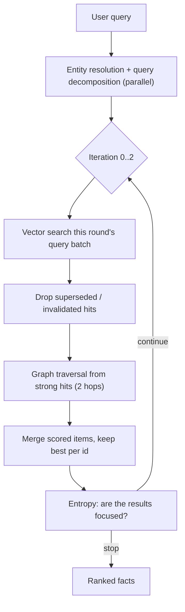

# Manfred Memory System

A long-term memory system for a personal AI assistant. It reads what you tell it, extracts the entities, facts, events and relationships out of the conversation, and stores them in a knowledge graph that is simultaneously indexed for semantic search. Later, it retrieves what is relevant and answers from it.

Everything runs locally: Neo4j for structure, ChromaDB for vectors, Ollama for both generation and embeddings. No data leaves the machine unless you configure the OpenRouter provider.

```
memory_system/
├── menfred_V2_backend/     NestJS backend, also publishable as the @menfred/memory SDK
├── menfred-v2-frontend/    Angular 19 debug UI
├── start.sh                Preflight checks, build, start backend + frontend
└── stop.sh                 Kill ports 4200, 3000, 8000 and orphaned Chroma processes
```

## The dual store

Every memory is written to **both** databases, keyed by a shared `chromaId`.

Neo4j holds the structure and is the source of truth. It is where relationships live, and where truth maintenance happens — a `SUPERSEDES` edge and an `invalidatedAt` timestamp are what make a memory stale, and retrieval filters on them. ChromaDB holds the same content as embeddings and answers the question "what is semantically close to this query." Neither store can do the other's job: the graph cannot find "things like this" and the vector index cannot express "who is connected to whom."

Writes go to Neo4j first, then Chroma with up to two retries. If Chroma fails the Neo4j record is kept rather than rolled back, and `StoreIntegrityService` reconciles the two on every boot — missing Chroma documents are re-upserted from Neo4j, and Chroma orphans with no Neo4j node are deleted.

### What gets stored

| Neo4j label | Meaning | Chroma collection |
|---|---|---|
| `Entity` | A person, place, thing, concept or organization. Gets a matching sub-label. | `entities` |
| `Fact` | Something the user stated. Confidence 1.0, source `stated`. | `episodes` |
| `Belief` | Something the assistant concluded on its own. Confidence 0.5, source `monologue`. | `beliefs` |
| `Episode` | A timestamped occurrence: a conversation turn, an event, a summary, a pattern. | `episodes` |

Facts and beliefs are deliberately separated. A fact is what you said; a belief is what the system inferred. Beliefs enter with half the confidence, decay faster during ranking (72-hour half-life against 168 hours for facts), are filtered out below 0.7 confidence at retrieval, and get invalidated outright when you state a fact that contradicts them. The system is built to trust you over itself.

Episodes are stratified by a `level` property, and consolidation moves information up the hierarchy:

| Level | Contents |
|---|---|
| 3 | Raw conversation turns, one per message |
| 2 | Event summaries — either extracted from a message or condensed from level 3 |
| 1 | Patterns detected across level 2 episodes |
| 0 | Facts (always level 0) |

Relationship types in the graph: `RELATES_TO` (entity to entity), `HAS_FACT`, `HAS_BELIEF`, `PARTICIPATED_IN` (entity to episode), `FOLLOWED_BY` and `DERIVED_FROM` (episode to episode), `SUMMARIZED_BY` and `PATTERN_OF` (consolidation edges), `YIELDED` (pattern promoted to fact), and `SUPERSEDES` (truth maintenance).

## Writing: how a message becomes memory

`MessageIngestorService.ingest()` runs on every user message. The raw turn is stored immediately as a level 3 episode and chained to the previous turn with `FOLLOWED_BY`. Then a single LLM call extracts entities, facts, events and relationships as JSON. The prompt resolves first-person pronouns to the configured user name, converts relative dates like "yesterday" into absolute ISO dates, and — importantly — returns empty arrays for questions, so asking something doesn't fabricate memories.

Each extracted entity goes through two-phase resolution before anything is created: an exact name lookup in Neo4j first, then a vector similarity fallback under 0.4 distance. Only if both miss is a new entity created. This is what stops "my brother" and "Ali" from becoming two separate people.

Facts are deduplicated against existing ones at 0.15 distance, then written and linked with `HAS_FACT`. At this point real-time correction fires: any existing fact, belief or relationship that is more than 0.5 cosine similar to the new one gets superseded or invalidated. Finally, extracted events become level 2 episodes with `PARTICIPATED_IN` edges to their participants and a `DERIVED_FROM` edge back to the source turn.

## Reading: the retrieval pipeline



An LLM resolves the query against conversation context, identifying entities, intents and any time constraints, while in parallel a second call decomposes the question into three to six sub-queries. Intent decides which Chroma collections are searched: `find_event` looks at episodes of level 2 or below, `find_pattern` at level 1 or below, `find_entity` at entities, relationships and beliefs.

Vector hits above the similarity threshold seed a graph traversal that walks up to two hops, following edges whose descriptions are at least 0.3 cosine similar to the query, and collects the facts and beliefs hanging off each entity. Results from the vector and graph phases are pooled and deduplicated, keeping the highest score per item.

### Entropy as a stopping signal

The loop needs to decide when it has searched enough, and it does that by measuring how *focused* the candidate set is rather than by asking an LLM. The top 10 candidates are standardized, pushed through a softmax with temperature \(\beta = 3\), and scored with Shannon entropy normalized by \(\log k\):

$$p_i = \frac{e^{\beta z_i}}{\sum_j e^{\beta z_j}}, \qquad H = \frac{-\sum_i p_i \log p_i}{\log k}, \qquad z_i = \frac{s_i - \mu}{\sigma}$$

The result lands in `[0, 1]`. Zero means one candidate clearly dominates; one means they are indistinguishable. Both normalizations matter. Restricting to a fixed top-k keeps the `log k` ceiling constant, so the number stays comparable across iterations instead of tracking how many candidates have piled up. Standardizing the scores first is what gives the softmax anything to work with, since raw similarities cluster in a narrow band and would otherwise produce a near-uniform distribution however strong the best hit was.

The loop stops when it is confident (best similarity at least 0.65 and entropy at most 0.5), when an extra round moved entropy by less than 0.05, when three iterations are done, or when the pool exceeds 200 candidates. Each iteration searches its own batch of sub-queries, and a round with no unsearched queries left ends the loop rather than repeating an identical search. If a time-filtered first pass finds nothing, the constraint is dropped and the query is retried.

Surviving facts are ranked by similarity weighted by exponential recency decay and capped at 40.

## Consolidation

Memory is reorganized in the background every 10 messages, at the end of a conversation, or on demand via `POST /userMessage/consolidate`. Six phases run in order, each driven by its own LLM prompt: level 3 turns are summarized into level 2 topics, level 2 episodes are mined for level 1 patterns, contradictions are resolved into new consolidated facts, stable patterns are promoted into facts, duplicate facts are merged, and finally entities that are the same thing under different names are merged into one, with all their edges re-pointed.

## HTTP API

Backend on port 3000. The frontend proxies `/api/*` to it.

| Method | Path | Description |
|---|---|---|
| `POST` | `/userMessage` | Full pipeline: ingest, retrieve, answer |
| `POST` | `/userMessage/stream` | Same, as a stream of SSE cognition events |
| `POST` | `/userMessage/recall` | Retrieval debug output — entities, intents, facts, vector hits |
| `POST` | `/userMessage/consolidate` | Trigger consolidation |
| `POST` | `/userMessage/endConversation` | New conversation id, then consolidate |
| `POST` | `/userMessage/eraseMemory` | Wipe Neo4j, Chroma and the conversation buffer |
| `GET` | `/monologue/stream` | SSE monologue events |
| `GET` | `/monologue/buffer` | Recent inner monologues and pause state |
| `POST` | `/llm` | Direct LLM passthrough |
| `GET`/`POST` | `/graph-db`, `/graph-db/{add,query,update}` | Raw Cypher |
| `POST` | `/chromadb/{add,query}` | Raw vector operations |

The backend is also publishable as `@menfred/memory`, a global NestJS module exposing `UnifiedMemoryService`. See [`menfred_V2_backend/README.md`](menfred_V2_backend/README.md) for the SDK configuration reference.

## Running it

Neo4j and Ollama must be running; ChromaDB is started by the backend itself in managed mode. You need `gemma3:12b` for generation and `bge-m3` for embeddings:

```bash
ollama pull gemma3:12b && ollama pull bge-m3
neo4j start && ollama serve

./start.sh    # builds the backend, starts both services, logs to ./logs/
./stop.sh
```

Frontend on http://localhost:4200, backend on http://localhost:3000.

Configuration is by environment variable, all with working localhost defaults:

| Variable | Default |
|---|---|
| `PORT` | `3000` |
| `NEO4J_URI` / `NEO4J_USER` / `NEO4J_PASSWORD` / `NEO4J_DATABASE` | `bolt://localhost:7687` / `neo4j` / `cognito2026` / `neo4j` |
| `OLLAMA_URL` / `OLLAMA_MODEL` | `http://localhost:11434` / `gemma3:12b` |
| `LLM_PROVIDER` | `ollama` (or `openrouter`) |
| `OPENROUTER_API_KEY` / `OPENROUTER_MODEL` / `OPENROUTER_URL` | empty / empty / `https://openrouter.ai/api/v1` |
| `CHROMA_HOST` / `CHROMA_PORT` / `CHROMA_DATA_PATH` | `localhost` / `8000` / `./chroma_data` |
| `CHROMA_MANAGED` | managed unless set to `false` |

The default Neo4j password is a development placeholder and should be overridden anywhere the database is reachable from outside localhost.

```bash
cd menfred_V2_backend
npm install
npm test              # unit tests, no external services required
npm run start:dev
```

## Current state

The system is under active development and some of what is in the tree is not yet live. Worth knowing before reading the code:

- **The inner monologue is disabled.** `MonologueService` implements a full background reflection loop — it picks a seed topic, retrieves against it, reasons for up to four iterations with a `<SEARCH>` tag that triggers follow-up lookups, produces a short diary-style thought, and extracts beliefs from the result. `resume()` currently returns immediately, so none of it runs. The SSE endpoint and frontend panel are wired and will simply stay quiet. Because belief ingestion hangs off this loop, beliefs are not currently being created in normal operation, though everything that reads and invalidates them is live.
- **The reactive cognition loop is skipped.** `CognitionService` goes straight from retrieval to answer generation. The `<SEARCH>`/`<READY>`/`<STORE>` prompt machinery exists but is not executed, and ingestion therefore runs unconditionally rather than waiting for the model to request it.
- **`SynthesisService` is not wired into the live path.** Answers come from the voice prompt in `CognitionService`. `UnifiedMemoryService.recall()` returns raw facts joined by newlines, not a synthesized answer, which contradicts the older backend README.
- **`src/memory-manager/` is superseded** by `src/unified-memory/` and is not loaded by `AppModule`.

Prompts and generated output are primarily in Persian.
